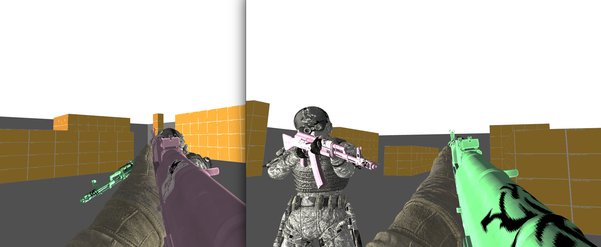

# Solana fps lobby

This project envisions a game lobby where users can join and view skins (that are compatible with the game), represented as NFTs on the Solana blockchain.

Creators of skins can upload them by interacting with the dedicated on chain program, where they can specify a maximum supply of a certain entry from the collection by using the metaplex print mechanism. See [ts_client](/ts_client/src/).


The skins are limited to customisation of albedo, roughness, normal, metalness and occlusion textures of a gun model and must adhere to the following extra fields in the metadata of a NFT:
```
*json*
{
    identifier : "fps+bq", //magic field to say the nft is compatible with the game
    textures: {
        a: Uri,
        r: Uri,
        n: Uri,
        m: Uri,
        ao: Uri,
    }
}
```


*Screenshot of the game*
